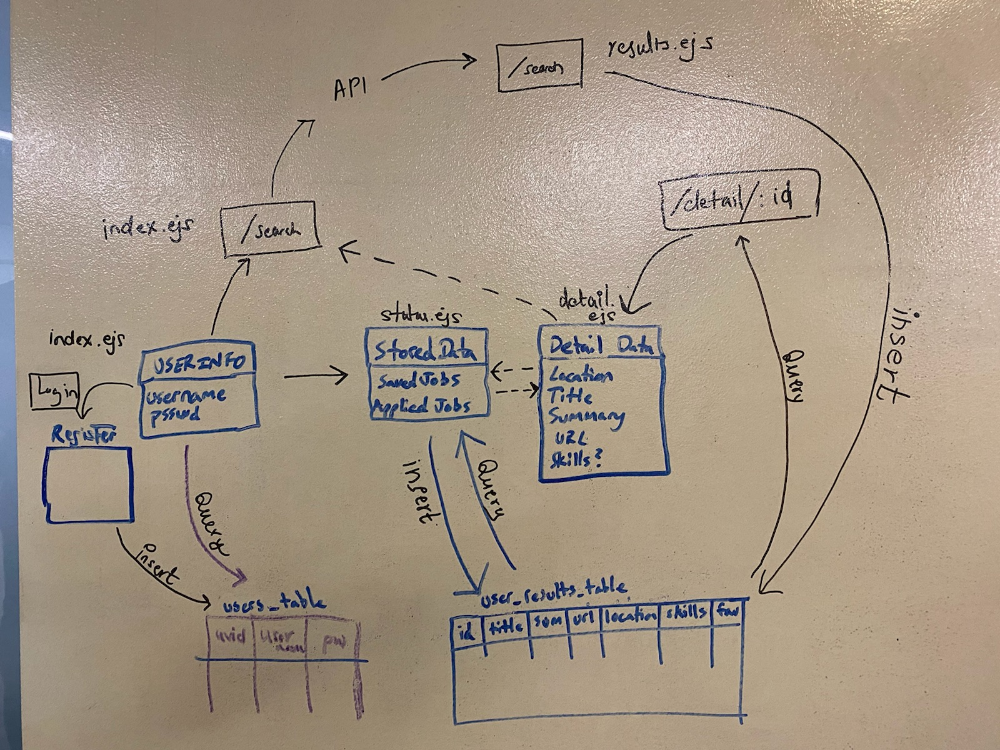

# JumpStart

**Version**: 1.0.0   
**Authors**:  
[Jin Woo Kim](https://github.com/jinwoov)  
[Vijayeta Rangarajan](https://github.com/vijayetar)  
[Robert James Nielsen](https://github.com/robertjnielsen)  

## Overview

Jumpstart is a mobile-friendly, responsive web app that enables users to search for job postings in USA. New users are required to register to the app with a username and unique 8-character password that is kept encrypted in the database. Returning users can login to the app with their unique username and password.  User can search by location and job title / keyword. They have ability to save their favorite jobs in a unique data table and can update the postings to either pending status, completed or even delete them from their table. 

## Getting Started

* The app an be accessed through the link:
https://jumpstartcf.herokuapp.com/.  

* The app can also be accessed through the local server using the github account: https://github.com/jumpstart-delete/jumpstart  
  - clone the github account to the terminal
  - install all the dependencies 
  - create a database in the psql
  - create extension pgcrypto in the psql database
  - then in terminal connect psql file name to the database
  - the app can be launched on localhost:8080 channel

## Dependencies

 * [dotenv: v8.2.0](https://www.npmjs.com/package/dotenv/v/8.2.0)  
 * [ejs: v3.0.1](https://www.npmjs.com/package/ejs/v/3.0.1)  
 * [express: v4.17.1](https://www.npmjs.com/package/express/v/4.17.1)  
 * [method-override: v3.0.0](https://www.npmjs.com/package/method-override/v/3.0.0)  
 * [pg: v7.17.1](https://www.npmjs.com/package/pg/v/7.17.1)  
 * [superagent: v5.2.1](https://www.npmjs.com/package/superagent/v/5.2.1)  
 * [pgcrypto extension](https://www.postgresql.org/docs/current/pgcrypto.html)  

## Change Log  

v0.1.0  1/30   CSS completed   
v0.0.7  1/30   LOGIN page password strength   
v0.0.6  1/29  ALL Saved JOB Listings with options to update and delete      
v0.0.4  1/29  VIEW DETAILS Page  
v0.0.3  1/28  RESULTS Page   
v0.0.2  1/27  SEARCH Page   
v0.0.1  1/27  LOGIN Page  

## Domain Model

## Wireframe
### Home

### Detail

### Status

### About Us

## Project Goals  
**MVP**  
* Jumpstart allows user to enter username and password, and have a password stored securely.  
* The password has limits that are checked by Regex.  
* The user can review their database content and update their status.  
* The user can make a new job search and review the results.  
* The user can select a job to look for more details and then add them to database or return to search page.  

**STRETCH GOALS**
* Allow more CSS to use clickable icons instead of buttons
* More feedback to users when the registration or password is not appropriate   
 

## Features of the app  

**Register new user and login features**
- Login for returning user with their unique password.  
- Hashing password with pgcrypto extension and saving it in the users table.  
- Password limits with 8 characters minimum, with one upper Case, one digit and one lower case minimum using Regex.   
- Creating separate users-table for each user in the same database.  

**Search Page and Results Page**
- Uses 4 API keys from four different database to narrow search to location and keyword
- Use Promise.all to resolve multiple promises  
- Shuffle data to shuffle the job search to present it across multiple pages   

**View Details**  
- Renders details for each job selected  
- Save to database from the details page   OR   
- Return to the results page  

**List Details**  
- Renders all jobs from the database - Filter jobs based on status
- Update job status  
- Delete job from the list  

## Routes used in the app   

* '/' index page is login page  - returning user is routed to '/list' page
* '/register' register as new user - new user is routed to '/search' page  
* '/search' render search  
* '/searches/new' displays search results   
* '/searches/detail' displays search results in detail  
* '/status' will review job in detail and add to database  
* '/status/:id' GET will find details from the database related to the params and POST will show it  
* '/update/:id' will PUT the updates from the job shown on the status page  
* '/delete/list/:id' will DELETE the job listing from the database  
*  '/list' will GET details from the database  
* '/update/list/:id' will PUT updated status on the list directly  
* '/delete/list/:id' will DELETE job from the list directly  

## References
* [ShuffleData](https://www.kirupa.com/html5/shuffling_array_js.htm)

* [PromiseAll](https://developer.mozilla.org/en-US/docs/Web/JavaScript/Reference/Global_Objects/Promise/all)  